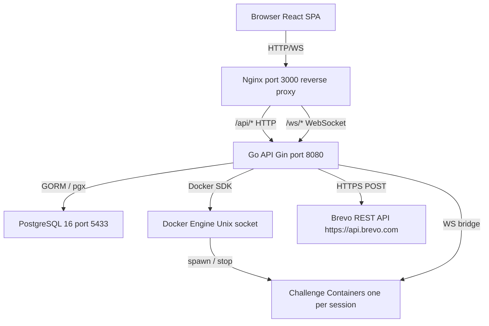
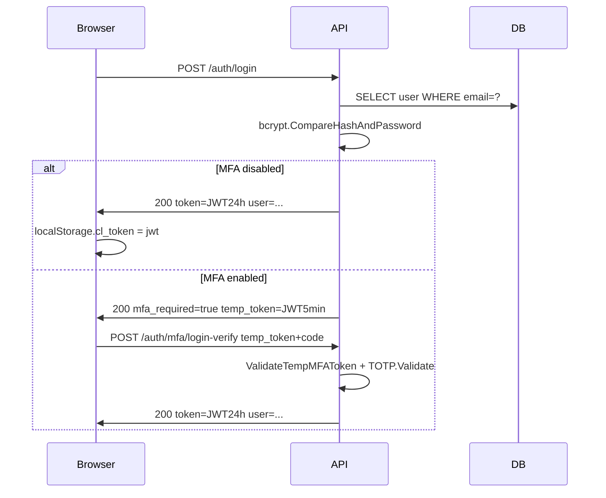
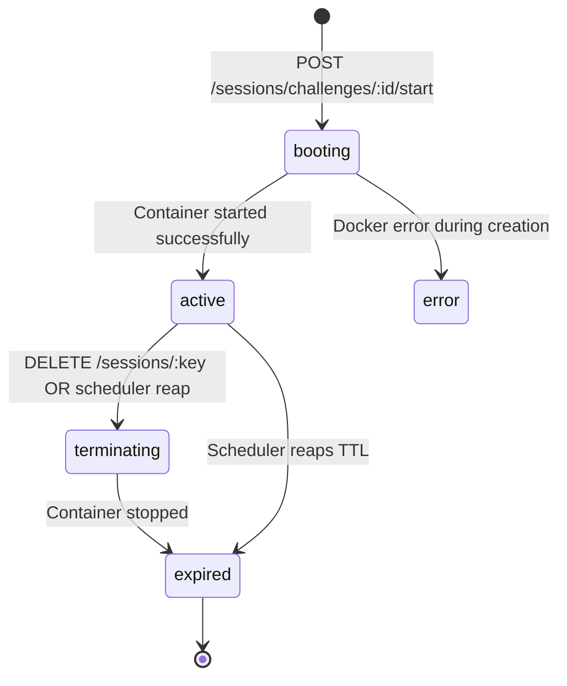

# ChallengeLabs

> A self-hosted Capture-The-Flag (CTF) platform where each challenge runs in an **isolated Docker container** with a real browser-based terminal -- no SSH required.

---

## Table of Contents

1. [Project Purpose](#1-project-purpose)
2. [Architecture Overview](#2-architecture-overview)
3. [Tech Stack](#3-tech-stack)
4. [Directory & File Structure](#4-directory--file-structure)
5. [Prerequisites](#5-prerequisites)
6. [Environment Variables](#6-environment-variables)
7. [Running Locally - Docker Recommended](#7-running-locally---docker-recommended)
8. [Running Locally - Hybrid Mode](#8-running-locally---hybrid-mode)
9. [Build & Deployment](#9-build--deployment)
10. [Docker Setup](#10-docker-setup)
11. [Database Schema & Seed Data](#11-database-schema--seed-data)
12. [Development / Test Credentials](#12-development--test-credentials)
13. [API Reference](#13-api-reference)
14. [Authentication Flow](#14-authentication-flow)
15. [OTP / Email Verification System](#15-otp--email-verification-system)
16. [Email Service Configuration](#16-email-service-configuration)
17. [MFA (TOTP) System](#17-mfa-totp-system)
18. [Premium Subscription System](#18-premium-subscription-system)
19. [Container / Session Lifecycle](#19-container--session-lifecycle)
20. [WebSocket Terminal](#20-websocket-terminal)
21. [Background Scheduler](#21-background-scheduler)
22. [Site Settings / Feature Flags](#22-site-settings--feature-flags)
23. [Frontend Pages & Components](#23-frontend-pages--components)
24. [Middleware](#24-middleware)
25. [Logging](#25-logging)
26. [Security Measures](#26-security-measures)
27. [Make Targets](#27-make-targets)
28. [Complete Request Flow](#28-complete-request-flow)
29. [Troubleshooting](#29-troubleshooting)
30. [Known Limitations & Future Improvements](#30-known-limitations--future-improvements)
31. [Onboarding Checklist for New Developers](#31-onboarding-checklist-for-new-developers)

---

## 1. Project Purpose

ChallengeLabs is a **self-hosted cybersecurity training platform**. Users register, browse published CTF challenges, and launch them. Each challenge spins up a dedicated Docker container; the user gets a full Linux terminal inside the browser (xterm.js over WebSocket). When they find the flag and submit it, the platform verifies it against a bcrypt hash and awards points. A live leaderboard ranks all participants.

**Key differentiators:**
- Each challenge container is **ephemeral and isolated** -- containers are automatically killed on expiry or idle timeout.
- **No SSH needed** -- the terminal runs entirely in the browser.
- **Admin panel** for managing challenges, categories, users, and site-wide settings.
- **Optional TOTP-based MFA** per user.
- **Premium subscription tier** -- premium challenges are gated behind a paid subscription (payment gateway integration pending).

---

## 2. Architecture Overview



**Request path:**
1. Browser sends `fetch('/api/v1/...')` to Nginx (port 3000).
2. Nginx proxies to Go API (port 8080) on the internal Docker network.
3. API authenticates via JWT, applies rate limiting, runs business logic.
4. Writes/reads from PostgreSQL via GORM.
5. For terminal sessions: API proxies stdin/stdout between the browser WebSocket and `docker exec` on the challenge container.

---

## 3. Tech Stack

### Backend
| Component | Technology |
|---|---|
| Language | Go 1.25 |
| HTTP framework | Gin v1.10 (github.com/gin-gonic/gin) |
| ORM | GORM v1.25 + gorm.io/driver/postgres |
| JWT | github.com/golang-jwt/jwt/v5 |
| WebSocket | github.com/gorilla/websocket v1.5 |
| Docker client | github.com/docker/docker v26 |
| TOTP / MFA | github.com/pquerna/otp v1.5 |
| Scheduler | github.com/robfig/cron/v3 |
| Env loading | github.com/joho/godotenv |
| Password hashing | golang.org/x/crypto/bcrypt |
| Email | Brevo REST API (HTTPS POST) |

### Frontend
| Component | Technology |
|---|---|
| Language | TypeScript |
| Framework | React 19 |
| Build tool | Vite 8 |
| Routing | React Router DOM v7 |
| Terminal | xterm.js v6 + addon-fit + addon-web-links |
| Icons | lucide-react |
| CSS | Vanilla CSS (custom design system in index.css) |

### Infrastructure
| Component | Technology |
|---|---|
| Database | PostgreSQL 16 Alpine |
| API container | Alpine 3.20, statically linked Go binary |
| Frontend container | Nginx 1.27 Alpine serving React SPA |
| Orchestration | Docker Compose |

---

## 4. Directory & File Structure

```
challengelabs-backend/
├── cmd/
│   ├── server/
│   │   └── main.go              # Server entry point -- wires all components
│   └── seed/                    # Database seed runner
├── config/
│   └── config.go                # Loads all env vars, builds Config struct
├── internal/
│   ├── auth/
│   │   └── jwt.go               # JWTService: GenerateToken, ValidateToken, MFA temp tokens
│   ├── container/
│   │   └── manager.go           # Docker SDK wrapper: Create, Stop, Stats, IsRunning
│   ├── email/
│   │   └── brevo.go             # Mailer: sends OTP emails via Brevo REST API
│   ├── handlers/
│   │   ├── admin.go             # Admin: Stats, ListUsers, GetUser, SetRole, SetUserPassword
│   │   ├── auth.go              # Auth: Register(2-step), Login, MFA, ForgotPassword, Me, Profile
│   │   ├── category.go          # Category: CRUD
│   │   ├── challenge.go         # Challenge: List, Get, Create, Update, Delete, SubmitFlag, Leaderboard
│   │   ├── dev.go               # Dev-mode only: auth-bypass session/terminal routes
│   │   ├── helpers.go           # generateSessionKey()
│   │   ├── mfa.go               # MFA: Setup, Enable, Disable
│   │   ├── premium.go           # Premium: Status, Request(placeholder), AdminSet
│   │   ├── router.go            # Gin engine: CORS, all routes, rate limiters
│   │   ├── session.go           # Session: Start, Terminate, Status, Stats, ListActive, Reconnect
│   │   ├── settings.go          # Settings: PublicSettings, List (admin), Update (admin)
│   │   ├── terminal.go          # WebSocket terminal bridge
│   │   └── static/
│   │       └── terminal.html    # Embedded xterm.js dev UI
│   ├── middleware/
│   │   ├── auth.go              # AuthRequired, AdminRequired, GetUserID
│   │   └── ratelimit.go         # Sliding-window IP rate limiter
│   ├── models/
│   │   └── models.go            # GORM models: User, Category, Challenge, Task, Session,
│   │                            #   UserProgress, SiteSetting, OTPCode
│   ├── otp/
│   │   └── service.go           # OTP: GenerateAndSend, Verify, GenerateTOTPSecret, VerifyTOTP
│   ├── repository/              # GORM-backed repositories for each model
│   ├── scheduler/
│   │   └── scheduler.go         # Cron jobs: reap sessions, broadcast expiry warnings
│   ├── session/
│   │   └── store.go             # session.Store interface + MemoryStore
│   └── ws/
│       └── hub.go               # WebSocket Hub: per-session broadcast
├── pkg/
│   └── logger/
│       └── logger.go            # Structured logger (slog wrapper)
├── challenges/
│   └── nginx-port-discovery/
│       └── Dockerfile           # Builds challengelabs-nginx:latest
├── frontend/
│   ├── Dockerfile               # Node 22 builder -> Nginx 1.27 runtime
│   ├── nginx.conf               # SPA fallback + /api/* + /ws/* proxy rules
│   ├── vite.config.ts           # Dev proxy: /api -> :8080, /ws -> ws://localhost:8080
│   ├── package.json
│   └── src/
│       ├── App.tsx              # Router, route guards (RequireAuth, RequireAdmin, GuestOnly)
│       ├── index.css            # Full design system (dark/light theme variables)
│       ├── api/
│       │   ├── client.ts        # fetch wrapper, JWT from localStorage key cl_token
│       │   ├── types.ts         # TypeScript interfaces: User, Challenge, Session, etc.
│       │   ├── auth.ts          # authApi
│       │   ├── challenges.ts    # challengesApi
│       │   ├── sessions.ts      # sessionsApi
│       │   ├── admin.ts         # adminApi
│       │   ├── premium.ts       # premiumApi
│       │   └── settings.ts      # settingsApi
│       ├── context/
│       │   ├── AuthContext.tsx  # user, login(), logout(), refreshUser(), isAdmin
│       │   ├── ThemeContext.tsx # dark/light toggle, persisted in localStorage cl_theme
│       │   ├── SettingsContext.tsx # fetches /settings on mount
│       │   └── ToastContext.tsx # global toast notifications
│       ├── components/
│       │   ├── layout/
│       │   │   ├── Sidebar.tsx  # Navigation links, user info, logout
│       │   │   └── TopBar.tsx   # Page header with theme toggle
│       │   ├── terminal/        # xterm.js wrapper
│       │   └── ui/              # Shared UI primitives (LoadingState, Badge)
│       └── pages/
│           ├── auth/
│           │   ├── LoginPage.tsx
│           │   ├── RegisterPage.tsx
│           │   └── ForgotPasswordPage.tsx
│           ├── DashboardPage.tsx
│           ├── ChallengePage.tsx
│           ├── ChallengeDetailPage.tsx
│           ├── LeaderboardPage.tsx
│           ├── ProfilePage.tsx
│           ├── PremiumPage.tsx
│           └── admin/
│               ├── AdminDashboardPage.tsx
│               ├── AdminChallengePage.tsx
│               ├── AdminChallengeFormPage.tsx
│               ├── AdminUsersPage.tsx
│               ├── AdminCategoriesPage.tsx
│               └── AdminSettingsPage.tsx
├── schema.sql                   # PostgreSQL DDL
├── seed.sql                     # Initial data: admin users, categories, 4 sample challenges
├── Dockerfile                   # Multi-stage Go build -> Alpine runtime
├── docker-compose.yml           # PostgreSQL + API + Frontend + challenge image
├── Makefile                     # Developer shortcuts
├── go.mod / go.sum
├── .env                         # Local dev overrides (do NOT commit to production)
└── .env.example                 # Template for new developers
```

---

## 5. Prerequisites

| Tool | Version | Purpose |
|---|---|---|
| Docker | >= 24 | Container runtime for challenge containers and docker-compose |
| Docker Compose | >= 2.20 | Orchestrates all services |
| Go | >= 1.25 | Backend compilation (only needed for non-Docker development) |
| Node.js | >= 22 | Frontend build (only needed for non-Docker development) |
| Git | any | Source control |

> **Windows note:** Docker Desktop must have **Linux containers** mode enabled (default). The Docker socket is managed automatically by Docker Desktop.

---

## 6. Environment Variables

All variables are read from the environment (or a `.env` file in the project root). The `.env.example` documents the minimum required set.

### Server

| Variable | Default | Required | Description |
|---|---|---|---|
| `SERVER_PORT` | `8080` | No | TCP port the Go HTTP server listens on |
| `ENV` | `development` | No | `development` enables debug routes and Gin debug mode. `production` disables them |

### Store (Session Backend)

| Variable | Default | Required | Description |
|---|---|---|---|
| `STORE` | `postgres` | No | `postgres` = full stack. `memory` = no DB needed (dev/test only, auth routes disabled) |

### Database

| Variable | Default | Required | Description |
|---|---|---|---|
| `DB_HOST` | `localhost` | Yes (postgres) | PostgreSQL hostname. `postgres` inside Docker Compose, `localhost` for hybrid dev |
| `DB_PORT` | `5432` | Yes | PostgreSQL port. Docker Compose maps `5433` on host to `5432` inside container |
| `DB_USER` | `postgres` | Yes | PostgreSQL username |
| `DB_PASSWORD` | `postgres` | Yes | PostgreSQL password |
| `DB_NAME` | `challengelabs` | Yes | PostgreSQL database name |
| `DB_SSLMODE` | `disable` | No | `disable`, `require`, or `verify-full` |

### JWT

| Variable | Default | Required | Description |
|---|---|---|---|
| `JWT_SECRET` | (none) | **YES** | HMAC secret for signing JWTs. **Server refuses to start if empty.** Use 32+ random chars |
| `JWT_EXPIRY_HOURS` | `24` | No | JWT lifetime in hours |

### Docker (Challenge Containers)

| Variable | Default | Required | Description |
|---|---|---|---|
| `DOCKER_HOST` | `unix:///var/run/docker.sock` | No | Docker daemon endpoint |
| `CONTAINER_MAX_LIFETIME_MINUTES` | `60` | No | Hard TTL for any container session |
| `CONTAINER_IDLE_TIMEOUT_MINUTES` | `15` | No | Container killed if no WebSocket activity for this long |
| `CONTAINER_MEMORY_LIMIT_MB` | `512` | No | Memory limit per container (MB) |
| `CONTAINER_CPU_QUOTA` | `50000` | No | CPU quota in microseconds per 100ms. 50000 = 50% of one core |

### WebSocket

| Variable | Default | Required | Description |
|---|---|---|---|
| `WS_READ_BUFFER_SIZE` | `4096` | No | WebSocket read buffer size in bytes |
| `WS_WRITE_BUFFER_SIZE` | `4096` | No | WebSocket write buffer size in bytes |

### CORS

| Variable | Default | Required | Description |
|---|---|---|---|
| `ALLOWED_ORIGINS` | `http://localhost:3000,http://localhost:5173` | No | Comma-separated list of allowed CORS origins. Add your production frontend URL here |

### Email (Brevo)

| Variable | Default | Required | Description |
|---|---|---|---|
| `SMTP_HOST` | `smtp-relay.brevo.com` | No | Legacy field, kept for compatibility. Not used for sending |
| `SMTP_PORT` | `587` | No | Legacy field |
| `SMTP_USER` | (none) | No | Legacy field |
| `SMTP_PASSWORD` | (none) | No | Legacy SMTP key. Fallback if `BREVO_API_KEY` is not set |
| `SMTP_FROM` | `noreply@challengelabs.io` | No | The "from" email address. **Must be verified in Brevo** |
| `BREVO_API_KEY` | (none) | **YES for OTPs** | Brevo REST API key (`xkeysib-...`). Get from https://app.brevo.com/settings/keys/api |

**How to change email credentials:**
1. Log in to https://app.brevo.com
2. **Settings -> API Keys** -> generate a new key (`xkeysib-...` format)
3. **Senders & IP -> Senders** -> add and verify the sender email for `SMTP_FROM`
4. Update `BREVO_API_KEY` and `SMTP_FROM` in `docker-compose.yml`
5. Restart the API: `docker-compose up -d --force-recreate api`

---

## 7. Running Locally - Docker Recommended

```bash
# 1. Clone the repository
git clone <repo-url>
cd challengelabs-backend

# 2. Edit docker-compose.yml:
#    - Set JWT_SECRET to a strong random string
#    - Set BREVO_API_KEY to your xkeysib-... key
#    - Set SMTP_FROM to your verified Brevo sender email

# 3. Build and start all services
docker-compose up --build

# Available at:
#   Frontend:  http://localhost:3000
#   API:       http://localhost:8081
#   DB:        localhost:5433 (postgres / postgres / challengelabs)
```

Rebuild after code changes:

```bash
docker-compose build --no-cache api && docker-compose up -d --force-recreate api
docker-compose build --no-cache frontend && docker-compose up -d --force-recreate frontend
docker-compose up --build  # full rebuild
```

---

## 8. Running Locally - Hybrid Mode

Run PostgreSQL in Docker but Go server and frontend natively on your machine.

```bash
# 1. Start only PostgreSQL and build the challenge image
docker-compose up -d postgres challengelabs-nginx

# 2. Create .env from the example and edit it
cp .env.example .env
# Key values:
#   STORE=postgres
#   DB_HOST=localhost
#   DB_PORT=5433        (Docker maps 5433 host -> 5432 container)
#   JWT_SECRET=any-long-random-string
#   BREVO_API_KEY=xkeysib-...

# 3. Run the Go API
go run ./cmd/server/...

# 4. In another terminal, run the frontend dev server
cd frontend
npm install
npm run dev
# Available at: http://localhost:5173
# Vite proxies /api to :8080 and /ws to ws://localhost:8080
```

---

## 9. Build & Deployment

### Backend binary

```bash
make build
# or
go build -o bin/server ./cmd/server/...
# Produces a statically linked binary
```

### Frontend production build

```bash
cd frontend
npm ci
npm run build
# Output in frontend/dist/
```

### Production checklist

1. Set `ENV=production` (disables dev routes, enables Gin release mode)
2. Set a strong random `JWT_SECRET` (minimum 32 characters)
3. Set `BREVO_API_KEY` to a valid Brevo REST API key
4. Set `SMTP_FROM` to a verified Brevo sender email address
5. Set `ALLOWED_ORIGINS` to your actual frontend URL
6. Configure `DB_SSLMODE=require` if PostgreSQL has TLS enabled
7. Configure container resource limits appropriately for your hardware
8. Change default database passwords

---

## 10. Docker Setup

### Services in docker-compose.yml

| Container | Image | Host Port | Internal Port | Role |
|---|---|---|---|---|
| `cl_postgres` | `postgres:16-alpine` | `5433` | `5432` | Database |
| `challengelabs-nginx` | Built locally | exits after build | -- | Builds challenge Docker image, then exits |
| `cl_api` | Built from `./Dockerfile` | `8081` | `8080` | Go API |
| `cl_frontend` | Built from `./frontend/Dockerfile` | `3000` | `80` | React SPA + Nginx proxy |

### cl_api specifics

- Docker socket (`/var/run/docker.sock`) is **bind-mounted** so the API can spawn/stop challenge containers on the host Docker daemon.
- Health check: `wget -qO- http://localhost:8080/health` every 10 seconds, 5 retries.
- Frontend container waits for `cl_api` to pass health check before starting.

### cl_frontend specifics

Nginx config (`frontend/nginx.conf`):
- `/api/*` -> `http://api:8080` HTTP proxy (60s timeout)
- `/ws/*` -> `http://api:8080` WebSocket proxy (3600s timeout, Upgrade headers set)
- All other routes -> `index.html` (SPA fallback)
- Static assets cached 1 year with `Cache-Control: public, immutable`
- Gzip compression enabled for JS, CSS, JSON, SVG

### Volumes

| Volume | Mount | Purpose |
|---|---|---|
| `postgres_data` | `/var/lib/postgresql/data` | Persistent database storage across restarts |

### Schema and seed auto-load

PostgreSQL's `docker-entrypoint-initdb.d` runs SQL files alphabetically on first start (empty volume):
1. `01_schema.sql` (`schema.sql`) -- Creates all tables, indexes, and `leaderboard` view
2. `02_seed.sql` (`seed.sql`) -- Inserts admin users, categories, 4 sample challenges

---

## 11. Database Schema & Seed Data

### Tables

| Table | Key Columns | Notes |
|---|---|---|
| `users` | `id, username, email, password_hash, role, mfa_enabled, mfa_totp_secret, is_premium, premium_granted_at, premium_expires_at` | `role` in {user, admin}. Passwords bcrypt-hashed. TOTP secret never returned by API |
| `otp_codes` | `id, email, code_hash, purpose, expires_at, used` | `purpose` in {registration, forgot_password}. Codes bcrypt-hashed |
| `categories` | `id, name, slug, description` | Unique on name and slug |
| `challenges` | `id, title, slug, description, difficulty, points, docker_image, flag, is_published, is_premium, category_id` | Flag bcrypt-hashed. `difficulty` in {easy, medium, hard} |
| `tasks` | `id, challenge_id, order, title, description, is_required` | Ordered steps shown to the user. Cascade delete with challenge |
| `sessions` | `id, user_id, challenge_id, container_id, session_key, status, container_ip, expires_at, last_active_at` | One session = one Docker container. `status` in {booting, active, terminating, expired, error} |
| `user_progresses` | `id, user_id, challenge_id, completed, flag_submitted, points_awarded, completed_at` | Unique constraint on (user_id, challenge_id) |
| `site_settings` | `key, value` | Key-value pairs for feature flags |

### Views

| View | Purpose |
|---|---|
| `leaderboard` | LEFT JOIN users + user_progresses, aggregates total points, challenges solved, RANK() window function |

### Seed Data

Inserted by `seed.sql` on first database initialisation:

**Seeded Admin Accounts:**

| Username | Email | Password | Role |
|---|---|---|---|
| `admin` | `admin@challengelabs.local` | `admin123` | admin |
| `test123` | `test123@gmail.com` | `test1234` | admin |

**Seeded Categories:** Miscellaneous, Web Exploitation, Binary Exploitation, Cryptography

**Seeded Challenges:**

| Title | Slug | Difficulty | Points | Docker Image | Category |
|---|---|---|---|---|---|
| Nginx Port Discovery | `nginx-port-discovery` | easy | 50 | `challengelabs-nginx:latest` | Miscellaneous |
| SQL Injection 101 | `sqli-101` | easy | 100 | `alpine` | Web Exploitation |
| Buffer Overflow Basics | `bof-basics` | medium | 200 | `alpine` | Binary Exploitation |
| Caesar's Secret | `caesars-secret` | easy | 25 | `alpine` | Cryptography |

---

## 12. Development / Test Credentials

> **WARNING: Change all of these before deploying to production.**

| Account | Email | Password | Role |
|---|---|---|---|
| Default admin | `admin@challengelabs.local` | `admin123` | admin |
| Test admin | `test123@gmail.com` | `test1234` | admin |

**To change passwords in running system:** Log in as admin -> Admin -> Users -> click user -> Reset Password.

**To change seed data for fresh deployments:**
```bash
# Edit seed.sql: change crypt('admin123', gen_salt('bf')) to desired value
# Then destroy the volume and recreate:
docker-compose down -v
docker-compose up --build
```

**Browser localStorage keys:**
- `cl_token` -- JWT for authentication
- `cl_theme` -- Theme preference (`dark` or `light`)

---

## 13. API Reference

Base URL: `http://localhost:8081/api/v1` (direct) or `http://localhost:3000/api/v1` (through Nginx)

Authentication: `Authorization: Bearer <jwt>` header, or `?token=<jwt>` query param (WebSocket only).

### Health Check

```http
GET /health
```
```json
{ "status": "ok", "service": "challengelabs", "env": "development", "active_sessions": 3 }
```

### Public Settings (no auth required)

```http
GET /api/v1/settings
```
```json
{ "leaderboard_enabled": true }
```

---

### Auth Endpoints -- Rate limited: 10 requests/minute per IP

#### POST /api/v1/auth/register/request -- Step 1: Request OTP

```json
{ "username": "alice", "email": "alice@example.com", "password": "securepass" }
```
- Validates uniqueness of email and username
- Sends 6-digit OTP to email via Brevo
- **200:** `{ "message": "Verification code sent to your email." }`
- **409:** Email or username already taken
- **503:** BREVO_API_KEY not configured

#### POST /api/v1/auth/register/verify -- Step 2: Create Account

```json
{ "username": "alice", "email": "alice@example.com", "password": "securepass", "otp": "123456" }
```
- **201:** `{ "token": "<jwt>", "user": { id, username, email, role, is_premium, mfa_enabled, ... } }`
- **422:** Invalid or expired OTP

#### POST /api/v1/auth/login

```json
{ "email": "admin@challengelabs.local", "password": "admin123" }
```
- **200 (no MFA):** `{ "token": "<24h jwt>", "user": { ... } }`
- **200 (MFA enabled):** `{ "mfa_required": true, "temp_token": "<5-min jwt>" }`
- **401:** Invalid credentials

#### POST /api/v1/auth/mfa/login-verify

```json
{ "temp_token": "<5-min token>", "code": "123456" }
```
- **200:** `{ "token": "<24h jwt>", "user": { ... } }`

#### POST /api/v1/auth/forgot-password/request

```json
{ "email": "alice@example.com" }
```
- Checks email is registered first. Returns **404** if not found.
- **200:** `{ "message": "Verification code sent to your email." }`

#### POST /api/v1/auth/forgot-password/verify

```json
{ "email": "alice@example.com", "otp": "123456", "new_password": "newpassword" }
```
- **200:** `{ "message": "Password reset successful. You can now log in with your new password." }`
- **422:** Invalid or expired OTP

---

### Authenticated Endpoints -- Rate limited: 120 requests/minute per IP

All require `Authorization: Bearer <jwt>`.

#### GET /api/v1/auth/me
Returns current user profile including premium status and MFA state.

#### PUT /api/v1/auth/password
```json
{ "current_password": "old", "new_password": "newpassword" }
```

#### PATCH /api/v1/auth/me
```json
{ "username": "newname", "avatar_url": "https://..." }
```

#### POST /api/v1/auth/mfa/setup
Returns `{ "secret": "BASE32SECRET", "otpauth_url": "otpauth://totp/..." }`. Scan with Google Authenticator.

#### POST /api/v1/auth/mfa/enable
```json
{ "code": "123456" }
```
Call after /mfa/setup and scanning QR code.

#### POST /api/v1/auth/mfa/disable
```json
{ "code": "123456" }
```
Requires current TOTP code to disable.

#### GET /api/v1/categories
Returns all categories.

#### GET /api/v1/challenges
Returns published challenges (admins see all). Response: `{ "challenges": [...], "total": N }`.

#### GET /api/v1/challenges/:id
Accepts numeric ID or slug. Premium challenges return **403** `{ "error": "premium_required" }` for non-premium users.

#### POST /api/v1/challenges/:id/submit
```json
{ "flag": "CTF{the_flag_string}" }
```
- **200:** `{ "correct": true, "message": "flag accepted! well done.", "points": 100 }`
- **422:** `{ "correct": false, "message": "incorrect flag" }`

#### GET /api/v1/leaderboard?limit=50
```json
{ "leaderboard": [{ "rank": 1, "username": "alice", "total_points": 375, "challenges_solved": 4 }], "total": 1 }
```

#### GET /api/v1/premium/status
Returns `{ "is_premium": bool, "premium_granted_at": ..., "premium_expires_at": ... }`. Auto-revokes expired subscriptions.

#### POST /api/v1/premium/request
Placeholder -- returns a message that payment is not yet configured.

#### POST /api/v1/sessions/challenges/:challengeID/start
Spins up Docker container. Reuses existing session if container still running.
- **201:** `{ "session_key": "...", "status": "active", "container_ip": "...", "expires_at": "...", "remaining": 3600 }`

#### DELETE /api/v1/sessions/:sessionKey
Stops container and marks session expired.

#### GET /api/v1/sessions/:sessionKey/status
Returns session status including whether container is running.

#### GET /api/v1/sessions/:sessionKey/stats
Returns `{ "cpu_percent": 1.2, "memory_usage": 4194304, "memory_limit": 536870912, "memory_percent": 0.78 }`.

#### GET /api/v1/sessions
Lists all active sessions for the authenticated user.

#### GET /api/v1/sessions/challenges/:challengeID/reconnect
Returns existing active session for a challenge if container is still running.

---

### Admin Endpoints -- Requires role: admin

#### GET /api/v1/admin/stats
```json
{ "active_sessions": 5, "total_users": 42, "total_challenges": 10 }
```

#### GET /api/v1/admin/users?page=1&page_size=20
Paginated user list.

#### GET /api/v1/admin/users/:id
Get user by ID.

#### PATCH /api/v1/admin/users/:id/role
```json
{ "role": "admin" }
```
Valid values: `user`, `admin`.

#### PATCH /api/v1/admin/users/:id/password
```json
{ "new_password": "newpassword123" }
```
Admins can reset any user's password without knowing the current one.

#### PATCH /api/v1/admin/users/:id/premium
```json
{ "is_premium": true, "expires_at": "2026-12-31T23:59:59Z" }
```
`expires_at` is optional. Omit for unlimited premium.

#### Challenge CRUD

```
POST   /api/v1/admin/challenges          Create challenge
PUT    /api/v1/admin/challenges/:id      Update challenge
DELETE /api/v1/admin/challenges/:id      Soft-delete challenge
```

Create/update request body:
```json
{
  "title": "My Challenge", "slug": "my-challenge",
  "description": "# Markdown description",
  "difficulty": "easy", "points": 100,
  "docker_image": "challengelabs-nginx:latest",
  "flag": "CTF{plaintext_flag}",
  "tags": "web,beginner", "category_id": 1,
  "is_published": true, "is_premium": false,
  "tasks": [{ "order": 1, "title": "Step 1", "description": "...", "is_required": true }]
}
```
> **The flag is bcrypt-hashed before storage. The plaintext cannot be retrieved after creation.**

#### Category CRUD

```
POST   /api/v1/admin/categories
PUT    /api/v1/admin/categories/:id
DELETE /api/v1/admin/categories/:id
```

#### Site Settings

```
GET   /api/v1/admin/settings
PATCH /api/v1/admin/settings/leaderboard_enabled     { "value": "false" }
```

---

### WebSocket Terminal

```
GET /ws/terminal/:sessionKey?token=<jwt>
```

JWT must be in `?token=` query param (browsers cannot set custom headers on WebSocket upgrades).

**Server -> Client control messages (JSON):**
- `{ "type": "expiry", "remaining": 300 }` -- countdown tick every 30 seconds
- `{ "type": "status", "status": "expired", "error": "TTL exceeded" }` -- session killed

**Data frames:** Binary (raw stdin/stdout bytes)

---

### Development-Only Routes (ENV=development only -- bypass JWT)

```
GET    /terminal                              Embedded xterm.js HTML UI
POST   /dev/sessions/start?image=alpine       Start container (no DB needed)
DELETE /dev/sessions/:sessionKey             Stop dev session
GET    /ws/dev/terminal/:sessionKey          WebSocket terminal (no JWT)
```

These routes inject synthetic user (userID=1, role=admin) via `DevAuth()` middleware.

---

## 14. Authentication Flow



**JWT payload (auth.Claims in internal/auth/jwt.go):**
```json
{ "user_id": 42, "username": "alice", "role": "user", "exp": 1720000000, "iat": 1719913600, "iss": "challengelabs" }
```

`AuthRequired` middleware (`internal/middleware/auth.go`) extracts JWT from:
1. `Authorization: Bearer <token>` header
2. `?token=<token>` query param (for WebSocket connections)

`AdminRequired` middleware checks `role == "admin"` in Gin context (must chain after AuthRequired).

---

## 15. OTP / Email Verification System

**File:** `internal/otp/service.go`

### Generation (GenerateAndSend)

1. Invalidate all previous unused OTPs for `(email, purpose)` -- prevents replay attacks
2. Generate cryptographically random 6-digit code via `crypto/rand`
3. Bcrypt-hash the code, store in `otp_codes` table (expires in 10 minutes)
4. Call `mailer.SendOTP()` -> Brevo REST API

### Verification (Verify)

1. Query `otp_codes` for valid (unused, unexpired) record for `(email, purpose)`
2. `bcrypt.CompareHashAndPassword(storedHash, providedCode)`
3. If correct: mark `used=true` to prevent replay
4. Return `(true, nil)` on success, `(false, nil)` on failure

### OTP Purposes

| Purpose | Triggered by | Used in |
|---|---|---|
| `registration` | `POST /auth/register/request` | Verifies email before account creation |
| `forgot_password` | `POST /auth/forgot-password/request` | Verifies identity before password reset |

### Security Properties

- Codes are **bcrypt-hashed** at rest -- database breach does not expose codes
- Codes **expire** in 10 minutes
- Previous codes are **invalidated** when a new request is made
- Codes are **single-use** (marked used after first verify)
- For forgot-password: email is verified to be **registered** in the database first

---

## 16. Email Service Configuration

**File:** `internal/email/brevo.go`

The mailer uses the **Brevo REST API** (`POST https://api.brevo.com/v3/smtp/email`), not SMTP.

**Why REST API instead of SMTP?**
Brevo's SMTP relay (`smtp-relay.brevo.com:587`) restricts sending to a pre-authorized IP allowlist. Docker containers get a new IP on every restart, causing `525 "5.7.1 Unauthorized IP address"` errors. The REST API authenticates via the `api-key` header only -- no IP restriction.

**API key priority:**
1. `BREVO_API_KEY` env var (`xkeysib-...`) -- primary
2. `SMTP_PASSWORD` env var -- fallback for backward compatibility

**To change email provider:**
Replace the `send()` function in `internal/email/brevo.go`. The `SendOTP(to, purpose, code string) error` interface must remain unchanged.

**Email template:**
```
Hello,

Your ChallengeLabs verification code to [complete your registration / reset your password] is:

  123456

This code expires in 10 minutes. Do not share it with anyone.

-- ChallengeLabs Team
```

---

## 17. MFA (TOTP) System

**Files:** `internal/otp/service.go`, `internal/handlers/mfa.go`

Uses `github.com/pquerna/otp`. Compatible with Google Authenticator, Authy, and any RFC 6238 TOTP app.

**Setup flow:**
1. `POST /auth/mfa/setup` -- generates TOTP secret + `otpauth://` URL. Stores secret with `mfa_enabled=false`
2. User scans QR code generated from `otpauth_url` in their authenticator app
3. `POST /auth/mfa/enable { "code": "123456" }` -- verifies live TOTP, sets `mfa_enabled=true`

**Disable flow:**
- `POST /auth/mfa/disable { "code": "123456" }` -- verifies TOTP, clears secret, sets `mfa_enabled=false`

**Login with MFA (two-step):**
1. `POST /auth/login` returns `{ mfa_required: true, temp_token: "..." }` (5-min JWT, `role=mfa_pending`)
2. `POST /auth/mfa/login-verify { temp_token, code }` validates TOTP, issues full 24h JWT
3. `mfa_pending` role is explicitly rejected by `ValidateToken()` -- temp tokens cannot access any protected endpoint

---

## 18. Premium Subscription System

**Files:** `internal/handlers/premium.go`, `internal/models/models.go`

**User model premium fields:**
```go
IsPremium        bool       // current subscription state
PremiumGrantedAt *time.Time // when admin granted it
PremiumExpiresAt *time.Time // nil = unlimited, otherwise auto-revoked on read
```

**How it works:**
- Admins grant/revoke via `PATCH /api/v1/admin/users/:id/premium`
- Premium challenges (`is_premium=true`) gate access: non-premium, non-admin users get **403 premium_required**
- `GET /api/v1/premium/status` auto-revokes expired subscriptions and returns current state
- `POST /api/v1/premium/request` is a **placeholder** -- payment gateway not yet implemented

**Admin UI:** Admin -> Users -> click any user -> toggle Premium

**Frontend behaviour:**
- Sidebar: "Upgrade to Premium" (purple) for non-premium, "Premium ✓" (with Crown) for premium
- Crown icon next to username in sidebar footer for premium users

---

## 19. Container / Session Lifecycle

**Files:** `internal/handlers/session.go`, `internal/container/manager.go`, `internal/scheduler/scheduler.go`



**Session start logic (handlers/session.go:Start):**
1. Check existing active session for (user, challenge). If container still running: return it (session reuse)
2. Create session record with `status=booting`
3. Call `containerMgr.Create()` with 3-minute timeout -- runs `docker run` with resource limits
4. Update session: `container_id`, `container_ip`, `status=active`

**Scheduler jobs (every 30s or 2min):**
- `reapExpiredSessions` -- calls `containerMgr.Stop()` on containers past `expires_at`
- `reapIdleSessions` -- kills containers idle beyond `CONTAINER_IDLE_TIMEOUT_MINUTES`
- `broadcastExpiryWarnings` -- sends `{ type:"expiry", remaining:N }` via WebSocket Hub

---

## 20. WebSocket Terminal

**Files:** `internal/handlers/terminal.go`, `internal/ws/hub.go`

**How the terminal bridge works:**
1. Browser opens WebSocket: `ws://localhost:3000/ws/terminal/:sessionKey?token=<jwt>`
2. Nginx upgrades and proxies to `api:8080`
3. `TerminalHandler.Connect()`:
   - Validates JWT from query param
   - Looks up session by key
   - Verifies `sess.UserID == authenticatedUserID`
   - Runs `docker exec -it <containerID> /bin/sh`
   - Bidirectional bridge: WS binary frames ↔ container stdin/stdout
   - Registers connection with Hub for server-to-client broadcasts
4. Hub broadcasts (expiry warnings, status changes) to all connections sharing a session key

**Session idle tracking:** `last_active_at` is updated on each WebSocket data frame.

---

## 21. Background Scheduler

**File:** `internal/scheduler/scheduler.go`

Uses `robfig/cron/v3` with second precision (6-field cron expressions).

| Job | Schedule | Description |
|---|---|---|
| `reapExpiredSessions` | `*/30 * * * * *` (every 30s) | Terminates containers past their `expires_at` |
| `reapIdleSessions` | `0 */2 * * * *` (every 2min) | Terminates containers idle beyond configured timeout |
| `broadcastExpiryWarnings` | `*/30 * * * * *` (every 30s) | Sends countdown messages to all active WebSocket connections |

The scheduler is store-agnostic -- identical behaviour with `MemoryStore` (development) and `SessionRepository` (PostgreSQL).

---

## 22. Site Settings / Feature Flags

**Files:** `internal/handlers/settings.go`, `internal/models/models.go`

Settings are key-value pairs stored in the `site_settings` PostgreSQL table.

| Key | Type | Default | Description |
|---|---|---|---|
| `leaderboard_enabled` | string "true"/"false" | `true` | Shows/hides Leaderboard in sidebar and at /leaderboard route |

**Toggle via Admin UI:** Admin -> Site Settings

**Adding a new feature flag:**
1. Add constant in `internal/handlers/settings.go` (e.g., `KeyMyFeature = "my_feature"`)
2. Add to `allowed` map in `Update()` handler
3. Expose in `PublicSettings()` handler
4. Add to `PublicSettings` TypeScript interface in `frontend/src/api/settings.ts`
5. Consume in components via `const { settings } = useSettings()`

---

## 23. Frontend Pages & Components

### Route Guards (frontend/src/App.tsx)

| Guard | Behavior |
|---|---|
| `RequireAuth` | Redirects unauthenticated users to `/login` |
| `RequireAdmin` | Redirects non-admins to `/` |
| `GuestOnly` | Redirects already-authenticated users to `/` |

### All Routes

| Route | Component | Access |
|---|---|---|
| `/login` | `LoginPage` | Guest only |
| `/register` | `RegisterPage` | Guest only |
| `/forgot-password` | `ForgotPasswordPage` | Guest only |
| `/` | `DashboardPage` | Auth |
| `/challenges` | `ChallengePage` | Auth |
| `/challenges/:id` | `ChallengeDetailPage` | Auth |
| `/leaderboard` | `LeaderboardPage` | Auth |
| `/profile` | `ProfilePage` | Auth |
| `/premium` | `PremiumPage` | Auth |
| `/admin` | `AdminDashboardPage` | Admin |
| `/admin/challenges` | `AdminChallengePage` | Admin |
| `/admin/challenges/new` | `AdminChallengeFormPage` | Admin |
| `/admin/challenges/:id/edit` | `AdminChallengeFormPage` | Admin |
| `/admin/users` | `AdminUsersPage` | Admin |
| `/admin/categories` | `AdminCategoriesPage` | Admin |
| `/admin/settings` | `AdminSettingsPage` | Admin |

### React Contexts

| Context | Key Exports |
|---|---|
| `AuthContext` | `user`, `loading`, `login()`, `logout()`, `refreshUser()`, `isAdmin` |
| `ThemeContext` | `theme`, `toggle()` -- persisted in `localStorage.cl_theme` |
| `SettingsContext` | `settings.leaderboard_enabled` -- fetched from `/api/v1/settings` on mount |
| `ToastContext` | Global toast notification queue |

### API Client (frontend/src/api/client.ts)

- All API calls use relative path `/api/v1` (resolved by Nginx or Vite proxy)
- JWT read from `localStorage.getItem('cl_token')`
- Non-2xx responses throw `ApiError(status: number, message: string)`
- Supports: `client.get()`, `client.post()`, `client.put()`, `client.patch()`, `client.delete()`

---

## 24. Middleware

### AuthRequired (internal/middleware/auth.go)

Extracts and validates JWT from:
1. `Authorization: Bearer <token>` header
2. `?token=<token>` query param

Validates via `JWTService.ValidateToken()`. Rejects `mfa_pending` role. Injects `userID`, `username`, `role` into Gin context.

### AdminRequired (internal/middleware/auth.go)

Chains after `AuthRequired`. Aborts with **403** if `role != "admin"`.

### RateLimit (internal/middleware/ratelimit.go)

In-memory sliding-window limiter keyed by client IP.
- Auth group (`/api/v1/auth/*`): **10 requests/minute**
- API group (all other `/api/v1/*`): **120 requests/minute**
- Cleanup goroutine runs every 5 minutes

> **Note:** In-memory -- resets on restart. Not suitable for multi-instance deployments.

---

## 25. Logging

**File:** `pkg/logger/logger.go` -- wraps Go's `slog` standard library.

- `development` mode: human-readable text output
- `production` mode: JSON structured output

```go
logger.Info("Server started", "port", 8080, "env", "production")
logger.Error("Container create failed", "err", err, "session", key[:8])
logger.Warn("Container stop error", "id", id[:12], "err", err)
```

Check API logs: `docker logs cl_api --since 5m 2>&1`

---

## 26. Security Measures

| Measure | Implementation |
|---|---|
| Password storage | bcrypt default cost (~10 rounds) in `golang.org/x/crypto/bcrypt` |
| Flag storage | bcrypt-hashed before storage -- plaintext never persisted after challenge creation |
| OTP storage | bcrypt-hashed at rest -- resistant to database breaches |
| JWT signing | HMAC-SHA256 via `golang-jwt/jwt/v5` |
| MFA temp token | 5-min lifetime, `mfa_pending` role rejected by `ValidateToken()` |
| Rate limiting | IP-based sliding-window: 10/min auth, 120/min API |
| CORS | Explicit allowlist via `ALLOWED_ORIGINS` env var |
| Admin endpoints | Double middleware chain: `AuthRequired` + `AdminRequired` |
| Session ownership | `resolveUserSession()` verifies `sess.UserID == authenticatedUserID` |
| Container isolation | One Docker container per (user, challenge) pair |
| Container limits | 512 MB RAM cap, 50% CPU by default (configurable) |
| Dev routes | Only registered when `ENV=development` |
| Settings allowlist | `Update()` validates key against hardcoded allowlist |
| Soft deletes | GORM soft-delete on users and challenges -- no permanent API deletion |

---

## 27. Make Targets

```bash
make run          # go run ./cmd/server/... (reads .env)
make build        # go build -o bin/server ./cmd/server/...
make seed         # go run ./cmd/seed/...
make tidy         # go mod tidy && go mod verify
make lint         # golangci-lint run ./... (requires golangci-lint installed)
make docker-up    # docker compose up -d
make docker-down  # docker compose down
make docker-stack # docker compose up --build
```

---

## 28. Complete Request Flow

### Flag Submission

```
Browser
  -> POST /api/v1/challenges/1/submit { "flag": "CTF{...}" }
  -> Nginx (port 3000)
  -> Proxied to Go API (port 8080)

Go API pipeline:
  1. gin.Logger() + gin.Recovery()
  2. CORS middleware (validates Origin header)
  3. RateLimit middleware (120/min by IP)
  4. AuthRequired middleware: extracts JWT -> injects userID=42, role="user"
  5. ChallengeHandler.SubmitFlag():
     a. resolveChallenge(id=1) -> SELECT from challenges
     b. bcrypt.CompareHashAndPassword(challenge.Flag, "CTF{...}")
     c. ProgressRepository.Upsert({user_id=42, challenge_id=1, completed=true, points=100})
     d. Response: 200 { correct: true, points: 100 }
```

### Terminal Session Open

```
Step 1: Browser -> POST /api/v1/sessions/challenges/1/start (JWT)
  -> API validates JWT, finds challenge, checks for existing session
  -> docker run challengelabs-nginx:latest (3-min timeout)
  -> Creates session: { session_key: "xyz...", status: "active", container_id: "abc..." }
  -> Response 201: { session_key, status, expires_at, remaining }

Step 2: Browser -> WebSocket ws://localhost:3000/ws/terminal/xyz?token=<jwt>
  -> Nginx: upgrade + proxy to api:8080
  -> AuthRequired (query param token)
  -> TerminalHandler.Connect():
     a. FindByKey("xyz") -> session record
     b. Verify session.UserID == 42 (authenticated user)
     c. docker exec -it abc123 /bin/sh
     d. Goroutine 1: WS read -> container stdin
     e. Goroutine 2: container stdout -> WS write
     f. Register in Hub under key "xyz"

Step 3: Scheduler every 30s:
  -> Hub.Broadcast("xyz", { type:"expiry", remaining:3300 })
  -> Browser xterm.js receives control message, displays countdown

Step 4: On expiry:
  -> Scheduler: containerMgr.Stop(abc123)
  -> Hub.Broadcast("xyz", { type:"status", status:"expired" })
  -> Browser: shows "Session expired" overlay
```

---

## 29. Troubleshooting

### OTP emails not arriving

```bash
docker logs cl_api 2>&1 | grep -E "OTP|Brevo|error|401|201"
```

| Error | Cause | Fix |
|---|---|---|
| `"Key not found" 401` | Wrong API key type | Use `xkeysib-...` REST key, not `xsmtpsib-...` SMTP key |
| `503 email service not configured` | BREVO_API_KEY not set in container | Set it in docker-compose.yml and restart |
| Emails arrive in spam | Sender not verified or no domain | Verify sender in Brevo, or use a domain with proper SPF/DKIM |
| `status=201` in logs but no email | Brevo delivery issue | Check Brevo dashboard email log |

### Cannot log in with correct credentials

1. `docker exec cl_api env | grep JWT_SECRET` -- verify JWT_SECRET is set
2. Clear browser localStorage (DevTools -> Application -> Clear site data)
3. `docker logs cl_api | grep -E "401|500"` -- check for errors

### Challenge container fails to start

```bash
docker images | grep challengelabs    # verify image exists
docker-compose build challengelabs-nginx  # rebuild if missing
docker inspect cl_api | grep -A5 Mounts  # verify docker socket is mounted
```

### Database connection refused

```bash
docker ps  # cl_postgres should show (healthy)
docker logs cl_postgres | tail -20
```
In hybrid mode: ensure `DB_PORT=5433` (not 5432) in `.env`.

### Server refuses to start -- JWT_SECRET error

Set `JWT_SECRET` in `docker-compose.yml` or `.env`. Minimum 1 character, recommend 32+ random chars.

### Leaderboard not visible in sidebar

Admin -> Site Settings -> ensure `leaderboard_enabled` is `true`.

### docker-compose exits with error on Windows PowerShell

Usually cosmetic -- PowerShell treats some stderr output as errors. Check `docker ps` -- if containers show `Up`, ignore it.

---

## 30. Known Limitations & Future Improvements

### Current Limitations

- **Payment not implemented.** `POST /api/v1/premium/request` is a placeholder only.
- **No email domain ownership.** `SMTP_FROM` must be a manually verified sender in Brevo.
- **In-memory rate limiter.** Resets on restart; doesn't work in multi-instance deployments.
- **Single-instance architecture.** WebSocket Hub and session store are in-process. No horizontal scaling without Redis.
- **No automated tests.** Zero test coverage. The `/dev/*` routes were designed with integration testing in mind but tests are not written.
- **Challenge flags are write-once.** After creation, the plaintext flag is gone -- only the bcrypt hash is stored.
- **No MFA recovery codes.** If a user loses their TOTP app with MFA enabled, an admin must reset their password and disable MFA manually via the database.

### Planned Improvements

- [ ] Payment gateway (Stripe/Razorpay) for premium subscriptions
- [ ] Redis-backed rate limiting and session store for horizontal scaling
- [ ] Per-challenge Docker network isolation (custom bridge networks per session)
- [ ] Challenge hints system with hint reveal cost
- [ ] Automated unit and integration tests
- [ ] Prometheus metrics endpoint (`/metrics`)
- [ ] Static file attachments for challenges
- [ ] Per-user progress history and score graph over time
- [ ] Team mode (shared progress, team leaderboard)
- [ ] Challenge import/export in JSON/YAML format
- [ ] TOTP backup codes for MFA recovery
- [ ] Challenge categories with per-category point multipliers

---

## 31. Onboarding Checklist for New Developers

- [ ] Install Docker Desktop with Linux containers mode enabled
- [ ] Clone the repository
- [ ] Run `docker-compose up --build` and verify all containers are healthy (`docker ps`)
- [ ] Open http://localhost:3000 and log in with `admin@challengelabs.local` / `admin123`
- [ ] Read `config/config.go` to understand all configuration options
- [ ] Read `internal/handlers/router.go` to understand the complete route map
- [ ] Read `internal/models/models.go` to understand the data model
- [ ] Read `internal/email/brevo.go` and `internal/otp/service.go` to understand the email/OTP system
- [ ] Go to Admin -> Challenges and verify 4 seed challenges are visible
- [ ] Start a "Nginx Port Discovery" challenge and confirm the terminal opens in the browser
- [ ] Get a Brevo REST API key (`xkeysib-...`) from https://app.brevo.com/settings/keys/api
- [ ] Verify a sender email at https://app.brevo.com/senders-and-ip/senders
- [ ] Update `BREVO_API_KEY` and `SMTP_FROM` in `docker-compose.yml`
- [ ] Test OTP registration flow with a real email address
- [ ] Go to Admin -> Site Settings -> test toggling the leaderboard off and on
- [ ] **Change default admin passwords before any public deployment**
- [ ] Set a strong `JWT_SECRET` (32+ random characters) before production
- [ ] Review the security measures table in Section 26 before going live
